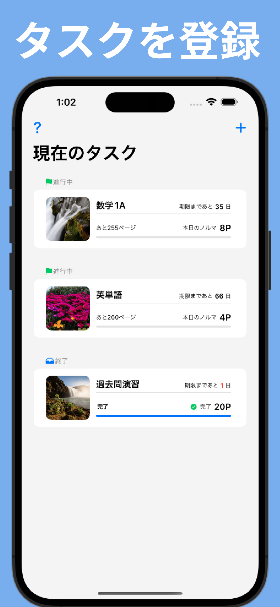
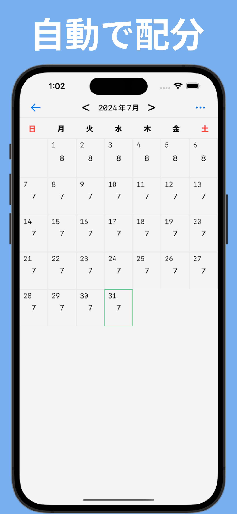
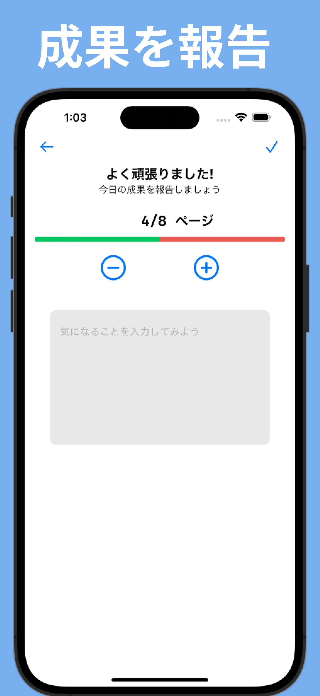
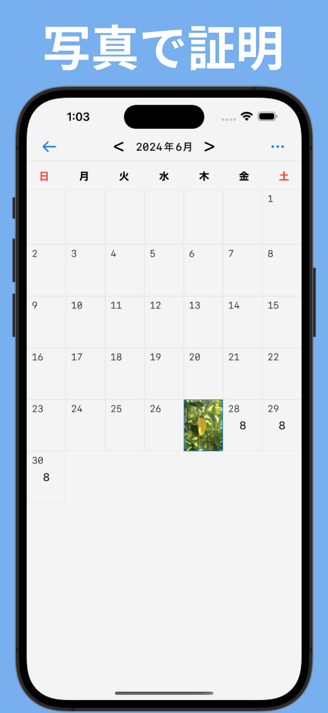

# アプリの概要

__PhotoTask(フォトタスク)__ は、締め切りと合計ページ数を設定すると

今日やるべきページ数を自動で計算し、進捗を写真で記録できる学習計画支援アプリです。  

・ 勉強の計画を立てる時、予定外の出来事で何度も計画を修正したことはありますか？

・ 毎日の成果を写真で振り返りたいと思ったことはありませんか？

そんなあなたの学習を支援するアプリを制作致しました。

# 主な機能

● タスクの登録

●ページ数の自動逆算機能

●カレンダーを見て現状把握

●進捗の登録、確認

●写真で継続の成果を振り返る

# スクリーンショット

</img>
</img>
</img>
</img>

# お問い合わせ

サービスの不具合や問題報告、その他お問い合わせは下記メールアドレスよりお願い致します。

メールアドレス : kouki.shito.business@gmail.com

 
